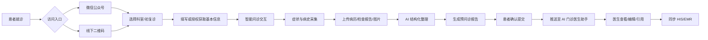
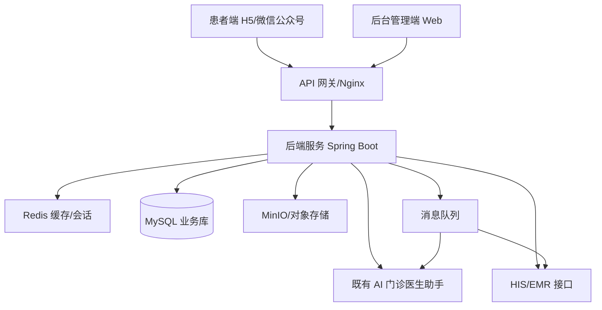
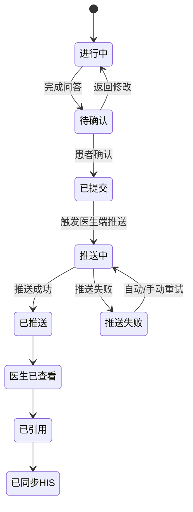

# 智能预问诊系统需求设计文档

版本：V1.0  
日期：2026-07-16  
适用范围：患者端、后台管理端、AI 门诊医生助手对接

## 1. 项目背景

智能预问诊系统用于在患者正式就诊前，通过微信公众号、线下扫码等入口采集患者基本信息、主诉、现病史、既往史、过敏史、检查资料等内容，并调用现有 AI 门诊医生助手生成结构化问诊报告和门诊电子病历草稿，推送给医生查看、编辑和同步至 HIS/EMR 系统。

本项目不替代医生诊疗结论，系统输出内容仅作为医生接诊前的信息整理、病历草稿和辅助提醒，最终诊疗意见由医生确认。

参考资料：

- 本地需求文档：[智能预问诊需求整理.docx](http://192.168.2.122:8083/doc-wiki#/page/show?pageId=233)

## 2. 建设目标

1. 支持患者通过医院微信公众号、线下二维码进入智能预问诊。
2. 支持按科室、初复诊、患者年龄性别等条件启动差异化问诊流程。
3. 支持患者以聊天式交互完成症状采集、病史采集和资料上传。
4. 支持患者误触、退出后重新进入并恢复问诊进度。
5. 支持将患者口语化描述转为医学结构化表达。
6. 支持自动生成标准化问诊报告和门诊病历草稿。
7. 支持后台配置科室、问题库、问诊流程、症状选项、AI 对接参数。
8. 支持与既有 AI 门诊医生助手、HIS/EMR 系统打通。
9. 支持医生在既有 AI 门诊医生助手中查看、编辑、引用预问诊结果。

## 3. 角色与端划分

| 端 | 使用角色 | 主要职责 |
| --- | --- | --- |
| 患者端 | 患者、家属 | 发起预问诊、填写基本信息、回答问题、上传资料、确认问诊报告 |
| 后台管理端 | 医院管理员、科室管理员、医生管理员 | 管理科室、问答流程、问题库、症状库、报告模板、系统配置、数据统计 |
| AI 门诊医生助手 | 接诊医生 | 接收预问诊信息，查看 AI 生成病历，编辑后同步 HIS/EMR |

说明：AI 门诊医生助手已有，本期重点是完成患者端、后台管理端，以及与 AI 门诊医生助手的数据和流程打通。

## 4. 总体业务流程

## 5. 功能需求

### 5.1 患者端

#### 5.1.1 访问入口

- 微信公众号菜单入口：嵌入医院公众号，无需患者下载 App。
- 线下扫码入口：支持按医院、院区、科室、诊室生成二维码。
- URL 参数识别：支持携带科室、医生、挂号单、就诊人、来源场景等参数。
- 登录与身份识别：支持微信 OpenID、手机号验证码、医院就诊卡号/身份证号绑定。

#### 5.1.2 基本信息采集

- 就诊类型：初诊、复诊。
- 基本信息：姓名、性别、年龄、手机号、身份证号、就诊卡号。
- 就诊信息：科室、医生、预约/挂号记录、就诊时间。
- 特殊人群：儿童、孕产妇、老年人等可触发特殊问诊问题。

#### 5.1.3 智能问诊交互

- 聊天式问答：以医生问、患者答的形式进行。
- 多种回答方式：
  - 单选、多选。
  - 文本输入。
  - 数值输入，例如体温、血压、血糖。
  - 日期/时间选择，例如症状持续时间。
  - 身体部位选择，例如腹痛位置。
  - 图片/文件上传。
- 常见症状快捷选择：如发热、咳嗽、头痛、腹痛、恶心、乏力等。
- 问题动态分支：根据患者答案自动追问诱因、持续时间、严重程度、伴随症状、缓解因素。
- 问题回退与修改：允许患者重新修改上一轮或历史答案。
- 断点续问：患者退出或误触后，再次进入可恢复当前问诊进度。
- 不清楚选项：对体温、时间、诱因等无法确定内容提供“不清楚”入口。

#### 5.1.4 病史资料采集

- 主诉采集：主要症状、持续时间、就诊目的。
- 现病史采集：起病时间、诱因、发展过程、症状程度、伴随症状、治疗经过。
- 既往史采集：慢性病、手术史、传染病史、外伤史。
- 过敏史采集：药物、食物、环境过敏。
- 个人史采集：吸烟、饮酒、职业暴露、生活习惯。
- 家族史采集：遗传病、肿瘤、心脑血管疾病等。
- 女性专项：月经史、婚育史、妊娠情况。
- 儿童专项：出生史、喂养史、疫苗接种史。

#### 5.1.5 文件上传

- 支持上传病历、检查报告、检验报告、处方、患处图片。
- 支持图片压缩、格式校验、大小限制。
- 支持 OCR 识别检查报告文字，作为 AI 病历生成参考。
- 支持患者删除、重新上传。

#### 5.1.6 问诊报告

- 自动生成问诊报告，包含：
  - 患者基本信息。
  - 主诉。
  - 现病史。
  - 既往史。
  - 过敏史。
  - 个人史/家族史。
  - 上传资料摘要。
  - AI 风险提醒。
- 患者可预览并确认提交。
- 患者可返回修改重点答案。
- 提交后生成唯一问诊编号。

### 5.2 后台管理端

#### 5.2.1 系统首页

- 今日预问诊数量。
- 已提交、待医生查看、已同步 HIS 数量。
- 科室使用排行。
- 高危提醒数量。
- AI 调用成功率、失败率、平均耗时。

#### 5.2.2 科室管理

- 科室新增、编辑、启停。
- 科室层级管理。
- 科室二维码生成。
- 绑定医生、管理员和问诊模板。

#### 5.2.3 问题库管理

- 支持新增、编辑、删除问题。
- 支持问题类型：单选、多选、文本、数值、日期、部位、上传。
- 支持问题所属科室、症状、疾病、适用人群配置。
- 支持问题必填、可跳过、不清楚选项配置。
- 支持常用问题复制和版本管理。

#### 5.2.4 问诊流程管理

- 可视化配置问诊流程。
- 支持按答案配置下一题分支。
- 支持初诊/复诊不同流程。
- 支持通用问诊模板与专科问诊模板组合。
- 支持流程发布、下线、版本回滚。

#### 5.2.5 症状与医学术语管理

- 症状词库：维护患者口语化表达、同义词、标准医学术语。
- 身体部位库：维护部位层级和图示坐标。
- 常见症状快捷项：按科室配置展示顺序。
- 医学术语映射：如“头晕乎乎”映射为“头晕”，“烧得厉害”映射为“发热”。

#### 5.2.6 病历模板管理

- 配置门诊病历生成模板。
- 支持字段：主诉、现病史、既往史、过敏史、个人史、家族史、辅助检查。
- 支持按科室维护模板。
- 支持模板变量和示例预览。

#### 5.2.7 AI 对接配置

- 配置现有 AI 门诊医生助手接口地址、密钥、超时时间。
- 配置 AI 任务类型：问题生成、追问、病历整理、风险提醒。
- 支持 AI 调用日志、重试、失败告警。
- 支持人工规则兜底：AI 不可用时仍可提交基础问诊报告。

#### 5.2.8 数据查询与审核

- 查询患者预问诊记录。
- 按科室、医生、时间、状态筛选。
- 查看原始问答、AI 结构化结果、医生引用结果。
- 支持敏感操作审计。

#### 5.2.9 权限管理

- 用户管理：医院管理员、科室管理员、医生、运营人员。
- 角色权限：菜单权限、数据权限、操作权限。
- 数据范围：全院、科室、个人。

### 5.3 AI 门诊医生助手对接

#### 5.3.1 数据推送

- 患者确认提交后，将预问诊报告推送到 AI 门诊医生助手。
- 支持按医生、科室、挂号单、就诊卡号匹配。
- 支持推送失败重试。

#### 5.3.2 医生查看

- 医生可查看：
  - 患者基本信息。
  - 原始问答记录。
  - AI 生成门诊病历草稿。
  - 高危/异常提醒。
  - 上传资料。
- 支持复制、引用、一键带入病历编辑区。

#### 5.3.3 HIS/EMR 同步

- 医生确认后同步至 HIS/EMR。
- 支持同步状态回写：待同步、同步中、成功、失败。
- 失败原因可追踪。

## 6. 非功能需求

| 分类 | 要求 |
| --- | --- |
| 性能 | 常规问答接口响应小于 1 秒，AI 生成报告建议小于 10 秒 |
| 可用性 | 核心服务可用性不低于 99%，AI 失败时支持规则兜底 |
| 安全 | 全站 HTTPS，接口鉴权，敏感字段加密存储 |
| 隐私 | 患者授权后采集信息，支持访问审计和数据脱敏 |
| 兼容 | 支持微信内置浏览器、主流 Android/iOS 浏览器 |
| 扩展 | 支持新增科室、新增问诊模板、新增 AI 能力 |
| 审计 | 记录登录、查看、编辑、导出、同步等关键操作 |

## 7. 技术架构设计

### 7.1 前端技术栈

#### 患者端

| 技术 | 用途 |
| --- | --- |
| Vue 3 | 前端主框架 |
| Vite | 构建工具 |
| TypeScript | 类型约束，降低维护成本 |
| Vant 4 | 移动端 UI 组件 |
| Pinia | 状态管理 |
| Vue Router | 页面路由 |
| Axios | 接口请求 |
| WeChat JS-SDK | 微信授权、分享、扫码、图片能力 |

选择理由：患者端以微信 H5 为主，Vue 3 + Vant 适合快速实现移动端聊天问诊、表单、弹窗、选择器、上传等组件。

#### 后台管理端

| 技术 | 用途 |
| --- | --- |
| Vue 3 | 前端主框架 |
| Vite | 构建工具 |
| TypeScript | 类型约束 |
| Element Plus | 后台管理 UI 组件 |
| Pinia | 状态管理 |
| Vue Router | 菜单与权限路由 |
| ECharts | 数据统计图表 |
| Vue Flow 或 AntV X6 | 问诊流程可视化配置 |

选择理由：后台管理端以表格、表单、权限、流程配置为主，Element Plus 生态成熟，能在 1 个月内快速交付。

### 7.2 后端技术栈

| 技术 | 用途 |
| --- | --- |
| Java 17 | 后端开发语言 |
| Spring Boot 3 | 后端主框架 |
| Spring Security + JWT | 登录认证与接口鉴权 |
| MyBatis Plus | 数据访问 |
| MySQL 8 | 主业务数据库 |
| Redis | 问诊进度缓存、验证码、接口限流 |
| RabbitMQ | AI 生成、HIS 同步等异步任务 |
| MinIO | 图片、报告、附件对象存储 |
| Knife4j/OpenAPI | 接口文档 |
| XXL-JOB 或 Spring Scheduler | 定时重试、过期清理 |

选择理由：医院信息化项目常见 Java 技术栈，便于与 HIS/EMR 对接，也便于权限、安全、审计和长期维护。

### 7.3 部署建议

- 前端：Nginx 部署静态资源。
- 后端：Docker 或院内服务器部署 Spring Boot 服务。
- 数据库：MySQL 主从或定期备份。
- 文件：MinIO 私有化部署。
- 日志：按接口、AI 调用、HIS 同步、审计日志分类存储。

## 8. 前端界面设计

### 8.1 患者端页面

#### 页面结构

| 页面 | 核心内容 |
| --- | --- |
| 入口页 | 医院名称、服务说明、开始预问诊 |
| 就诊信息页 | 初复诊、科室、医生、挂号信息 |
| 基本信息页 | 姓名、性别、年龄、手机号、就诊卡号 |
| 智能问诊页 | 聊天区、答案区、快捷症状、输入框、上传按钮 |
| 部位选择页 | 人体部位图、部位标签、不清楚、确定 |
| 数值选择页 | 体温/血压等滚轮选择、不清楚、确定 |
| 上传资料页 | 图片/文件上传、预览、删除 |
| 报告确认页 | 基本信息、主诉、现病史、既往史、过敏史、提交按钮 |
| 提交成功页 | 问诊编号、医生查看状态、返回公众号 |

#### 患者端交互风格

- 顶部固定蓝色导航栏，保持与参考图一致。
- 中间为聊天式内容区，左侧为系统提问，右侧为患者回答。
- 底部为动态操作区，根据问题类型展示按钮、选择器、输入框。
- 常见症状使用胶囊按钮展示。
- 患者回答后显示“重新修改”入口。
- 报告页采用白底卡片式内容，重点字段分区展示。

#### 患者端界面示意

界面展示重点：

- 问诊采用聊天式交互，系统问题和患者回答左右分布，降低填写压力。
- 底部操作区随问题类型变化，支持初复诊选择、性别选择、症状标签、持续时间、体温滚轮、既往史多选等。
- 患者每次回答后提供“重新修改”，避免误触导致信息错误。
- 问诊报告突出主诉、现病史、既往史、过敏史，便于患者确认后提交给医生。

### 8.2 后台管理端页面

| 页面 | 功能 |
| --- | --- |
| 登录页 | 账号密码登录、验证码、忘记密码 |
| 工作台 | 数据概览、趋势图、待处理事项 |
| 科室管理 | 科室树、二维码生成、启停 |
| 问题库 | 问题列表、问题编辑、选项配置 |
| 流程配置 | 拖拽节点、分支规则、流程预览、发布 |
| 症状词库 | 症状、同义词、医学术语映射 |
| 模板管理 | 病历模板、报告模板、变量配置 |
| 问诊记录 | 患者记录、问答详情、报告详情、同步状态 |
| AI 日志 | 请求参数、响应结果、耗时、错误信息 |
| 用户权限 | 用户、角色、菜单、数据权限 |
| 系统设置 | AI 配置、HIS 配置、文件上传限制 |

#### 后台管理端界面示意

#### AI门诊助手界面示意

## 9. 状态流转设计

## 10. AI 处理逻辑

### 10.1 AI 输入

- 患者基本信息。
- 就诊科室、初复诊。
- 原始问答记录。
- 上传资料 OCR 文本。
- 问诊模板要求。
- 病历生成格式要求。

### 10.2 AI 输出

- 医学术语标准化结果。
- 主诉摘要。
- 现病史结构化描述。
- 既往史、过敏史、个人史、家族史。
- 异常风险提醒。
- 门诊病历草稿。
- 需要医生进一步确认的问题。

### 10.3 AI 质量控制

- AI 输出必须保留原始问答来源，方便医生追溯。
- 高危词如胸痛、呼吸困难、意识障碍、严重过敏等触发风险提醒。
- AI 生成失败时，系统按固定模板拼接原始问答形成基础报告。
- 医生端明确展示“AI 生成，仅供医生参考”。

## 11. 安全与合规设计

1. 患者敏感信息加密存储，身份证号、手机号按需脱敏展示。
2. 患者端访问使用短期 Token，后台端使用 JWT + 权限校验。
3. 文件访问使用签名 URL，避免附件被公开访问。
4. 后台查看患者隐私信息需记录审计日志。
5. AI 接口传输全程 HTTPS 或院内专线。
6. 严格区分 AI 辅助内容和医生确认内容。
7. 支持按医院要求配置数据保留期限和备份策略。

## 12. 一个月实施计划

总周期：4 周，控制在 1 个月内完成可上线 MVP。

| 周期 | 时间 | 工作内容 | 交付物 |
| --- | --- | --- | --- |
| 第 1 周 | 第 1-7 天 | 需求确认、原型确认、技术方案确认、项目脚手架、登录权限基础 | 原型图、技术方案说明、前后端基础工程 |
| 第 2 周 | 第 8-14 天 | 患者端入口、基本信息、聊天问诊、问题类型组件、断点续问、文件上传 | 患者端核心流程可跑通 |
| 第 3 周 | 第 15-21 天 | 后台科室管理、问题库、流程配置、模板管理、问诊记录、AI 接口联调 | 后台管理端可配置，AI 生成报告可用 |
| 第 4 周 | 第 22-30 天 | 医生助手推送、HIS/EMR 同步联调、权限审计、测试修复、部署上线 | 联调版本、测试报告、部署文档、上线版本 |

### 12.1 详细排期

| 日期 | 任务 |
| --- | --- |
| D1-D2 | 需求细化、确认科室范围、确认 AI 助手接口、确认 HIS/EMR 接口 |
| D3-D4 | UI 原型、技术方案、联调协议 |
| D5-D7 | 前后端脚手架、登录鉴权、基础字典、文件服务 |
| D8-D10 | 患者端基本信息、科室/初复诊、问诊会话 |
| D11-D12 | 问答组件、单选多选、文本输入、数值选择、部位选择 |
| D13-D14 | 断点续问、答案修改、上传资料 |
| D15-D17 | 后台问题库、科室管理、症状词库 |
| D18-D19 | 流程模板、分支规则、模板发布 |
| D20-D21 | AI 结构化整理、病历草稿生成 |
| D22-D23 | 推送 AI 门诊医生助手、状态回写 |
| D24-D25 | HIS/EMR 同步联调、异常重试 |
| D26-D27 | 权限、审计、统计看板 |
| D28-D29 | 全流程测试、兼容性测试、性能优化 |
| D30 | 部署上线、培训、验收 |

## 13. MVP 范围建议

为保证 1 个月内完成，第一期建议优先完成：

1. 微信 H5 患者端预问诊核心流程。
2. 3-5 个重点科室的问诊模板。
3. 常用问题类型：单选、多选、文本、数值、上传。
4. 患者断点续问和答案修改。
5. AI 生成问诊报告和门诊病历草稿。
6. 后台科室、问题库、流程模板基础管理。
7. 推送至既有 AI 门诊医生助手。
8. HIS/EMR 同步先按一个标准接口打通。

二期可扩展：

1. OCR 深度识别检验检查报告。
2. 更多专科精细化模板。
3. 医生端智能追问推荐。
4. 质控规则、病历完整性评分。
5. 多院区、多租户。
6. 运营分析和患者满意度分析。

## 14. 验收标准

| 模块 | 验收标准 |
| --- | --- |
| 患者端 | 患者可通过公众号/扫码完成一次完整预问诊并提交 |
| 断点续问 | 退出后再次进入能恢复到上次问题和答案 |
| 后台管理 | 管理员可维护科室、问题、流程、模板并发布 |
| AI 生成 | 系统可基于问答生成结构化报告和病历草稿 |
| 医生助手 | 医生端可收到并查看患者预问诊信息 |
| HIS/EMR | 医生确认后可同步或模拟同步病历 |
| 权限安全 | 不同角色只能访问授权数据，关键操作有日志 |
| 稳定性 | 主要流程连续测试无阻塞性错误 |

## 15. 主要风险与应对

| 风险 | 影响 | 应对 |
| --- | --- | --- |
| AI 助手接口不稳定 | 报告生成失败 | 增加重试、超时控制、模板兜底 |
| HIS/EMR 接口周期长 | 上线受阻 | 先完成模拟接口和中间表方案 |
| 专科问诊规则复杂 | 配置周期变长 | 一期先选重点科室和高频症状 |
| 患者输入不规范 | 结构化质量下降 | 增加选项引导、术语映射和医生确认 |
| 隐私合规要求高 | 数据安全风险 | 加密、脱敏、审计、权限隔离 |

## 16. 结论

本系统一期以“患者端采集、后台可配置、AI 生成病历、医生助手可查看”为核心闭环，优先打通预问诊到医生接诊前的信息流。通过 1 个月 MVP 建设，可先覆盖重点科室和常见症状，后续再逐步扩展专科模板、OCR、质控和运营分析能力。
